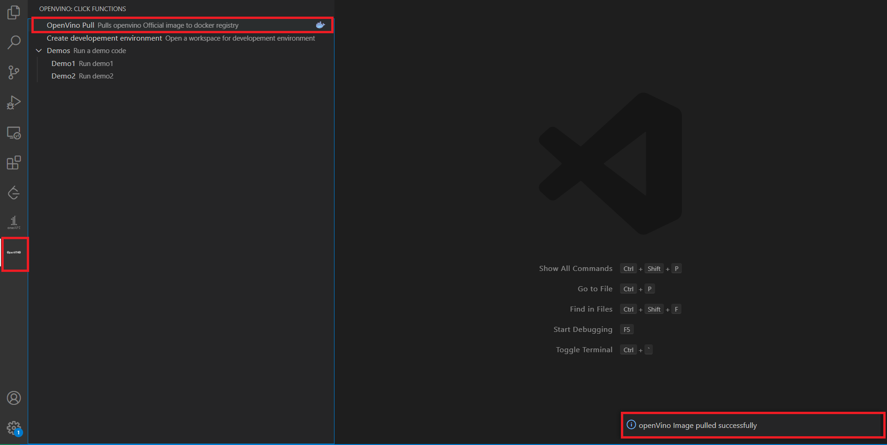
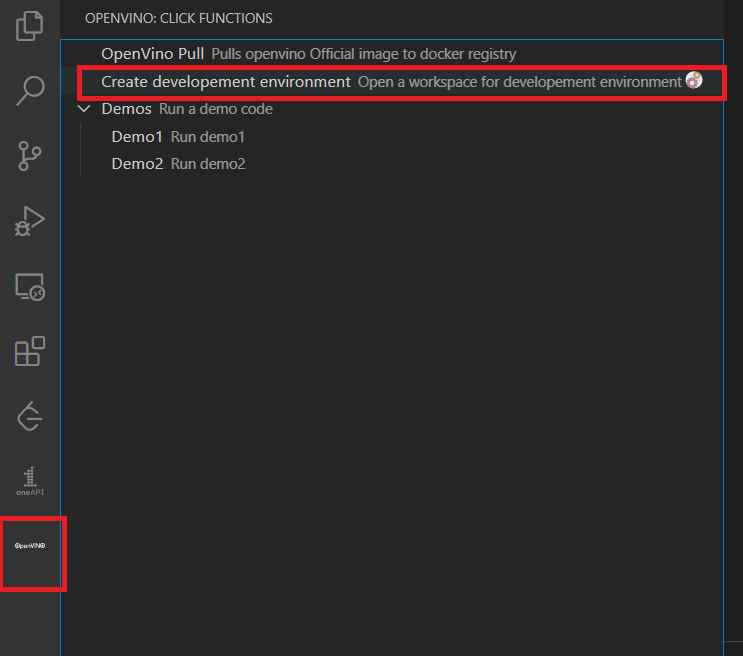
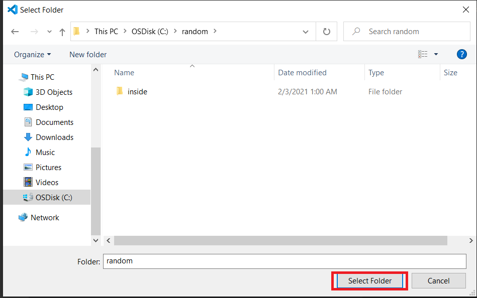
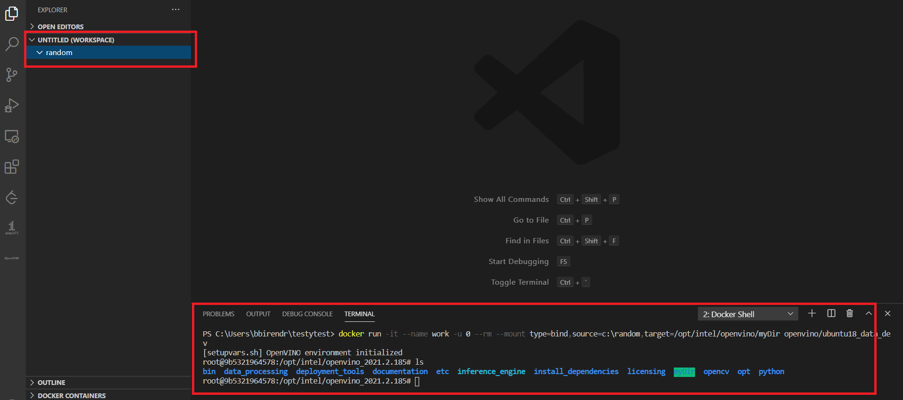
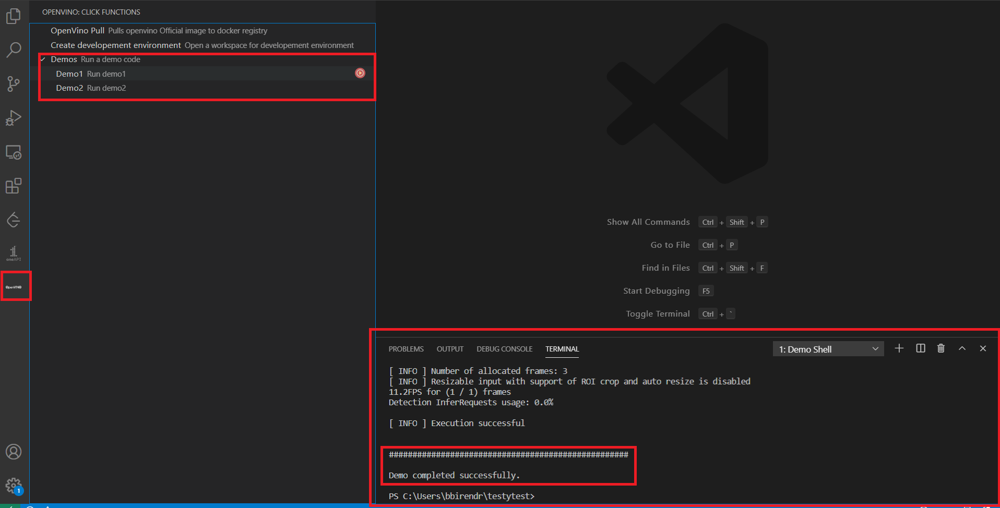

# openVINO extension dockerized Intel openVINO toolkit

A simple extension for getting started with openVINO development.
Helps optimizations of deep learning models from a framework and deployment using an inference engine onto intel hardware leveraging docker technology.

## Prerequisites
* [Docker](https://www.docker.com/) is installed.
* For Linux user, make sure you could manage Docker as a [non-root user](https://docs.docker.com/engine/install/linux-postinstall/) without sudo.
* For [proxied network](https://docs.docker.com/config/daemon/systemd/#httphttps-proxy) , make sure you can work with docker by making few changes.

## Pull Image

* Pull docker image from official openVINO docker repository

## Create developement environment

* Click on developement environment

* Select folder directory to use as workspace]

* Folder which is selected is used as workspace and is mapped to the folder myDir inside the container

## Run Demo

* This is for testing and running the demo inside the container
